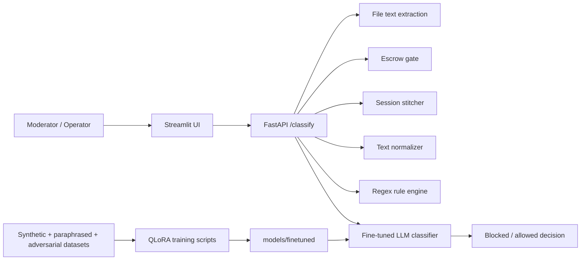

# SayzoGuard

## Problem
SayzoGuard is built to prevent contact or credential leakage in conversations before sensitive information leaves a platform. The repo focuses on messages that hide phone numbers, meeting links, account details, OTPs, or other restricted information across plain text, uploaded files, and multi-turn chat sessions.

## System Design

- Architecture:
  - operator-facing UI in [`client/streamlit_app.py`](C:\Users\91965\cars24\github-readme-batch\SayzoGuard\client\streamlit_app.py)
  - inference API in [`inference_server/app.py`](C:\Users\91965\cars24\github-readme-batch\SayzoGuard\inference_server\app.py)
  - rule and preprocessing layer in [`leakage/`](C:\Users\91965\cars24\github-readme-batch\SayzoGuard\leakage)
  - dataset generation and augmentation pipeline in [`dataset/`](C:\Users\91965\cars24\github-readme-batch\SayzoGuard\dataset)
  - LoRA fine-tuning scripts in [`model_training/qlora_train.py`](C:\Users\91965\cars24\github-readme-batch\SayzoGuard\model_training\qlora_train.py)
- Components:
  - LLM: Hugging Face causal language model loaded through `transformers` and quantized with `bitsandbytes`
  - DB: no persistent database is implemented in the repo; session state and escrow status are in-memory dictionaries
  - APIs: FastAPI classifier endpoint and Streamlit admin UI
  - OCR/File pipeline: `PyPDF2`, `PIL`, `pytesseract`
  - Guardrails: forbidden-link detection, regex scoring, normalization, multi-turn stitching

## Approach
- Why multi-agent?
  - This repo does not use a true multi-agent architecture. It uses a staged detection pipeline instead: escrow gating, context stitching, normalization, regex rules, then LLM classification. That makes the decision path easier to reason about and debug.
- Why RAG?
  - RAG is not used here. Leakage detection is treated as classification over current message content and recent session context, not as retrieval over a knowledge base.
- What is notable about the approach:
  - messages can be analyzed as raw text or extracted from files
  - obfuscated leaks are normalized before scoring
  - leakage spread across several turns can be reconstructed with the stitcher
  - dataset scripts generate synthetic, paraphrased, adversarial, and vision-based examples for training

## Tech Stack
- Python
- Streamlit
- FastAPI
- Transformers
- PEFT / LoRA
- BitsAndBytes
- Accelerate
- Torch
- PyPDF2
- Pytesseract
- Pillow
- scikit-learn
- Faker

## Demo
- Text mode:
  - open the Streamlit UI
  - enter a message and optional `task_id` / `session_id`
  - send it to `/classify`
- File mode:
  - upload a PDF, image, or text file
  - extract text locally
  - pass the extracted text to the classifier
- Example flow:
  - a `meet.google.com` link is detected
  - escrow is checked first
  - if escrow is unfunded, the API blocks the share immediately
  - otherwise the text is normalized, scored, and sent to the LLM for a final leakage judgment

## Results
- The repo does not publish formal evaluation metrics yet, but the implementation is designed to improve moderation efficiency in three concrete ways:
  - catches direct leaks with cheap rules before invoking the model
  - handles obfuscation and multi-turn leakage better than plain regex alone
  - gives moderators a single UI for both text and file-based inspection

## Learnings
- What worked:
  - combining rule-based filtering with an LLM gives a stronger safety pipeline than relying on one technique alone
  - dataset generation scripts cover several realistic failure modes, especially obfuscation and split-across-turn leakage
  - keeping OCR and file extraction close to the UI makes the demo flow straightforward
- What did not:
  - imports in [`inference_server/app.py`](C:\Users\91965\cars24\github-readme-batch\SayzoGuard\inference_server\app.py) assume a `sayzoguard` package path that is not reflected by the checked-in folder structure
  - escrow state and session history are stored only in memory, so they will reset on restart
  - there is no measured benchmark or labeled evaluation report in the repo yet

## Supporting Docs
- [Architecture diagram](docs/architecture.png)
- [Demo preview](docs/demo_preview.png)
- [Evaluation logs and outputs](docs/evaluation.md)
- [Sample inputs and outputs](docs/sample_io.md)
- [Rich example assets](docs/examples/)
- [Representative outputs](docs/outputs/)
